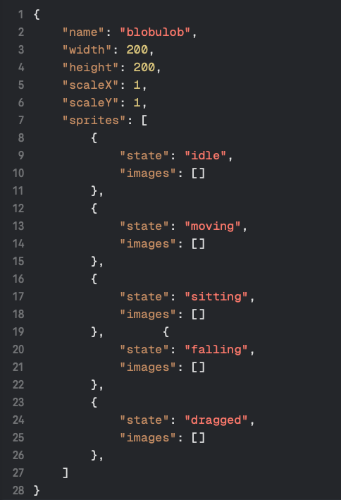

# DesktopPet

a goofy app for macos that lets you have a desktop pet!
i made this exclusively because i just want to have my ocs running around at the bottom of my screen.

## Pet configuration files

pet configs are stored in the JSON format. an example of a pet config is shown below.

the "images" field is an array of strings with images encoded in base64 by the way.

pet files should be stored at `~/Library/Application Support/com.radpebblez.DesktopPet/pets/`.
